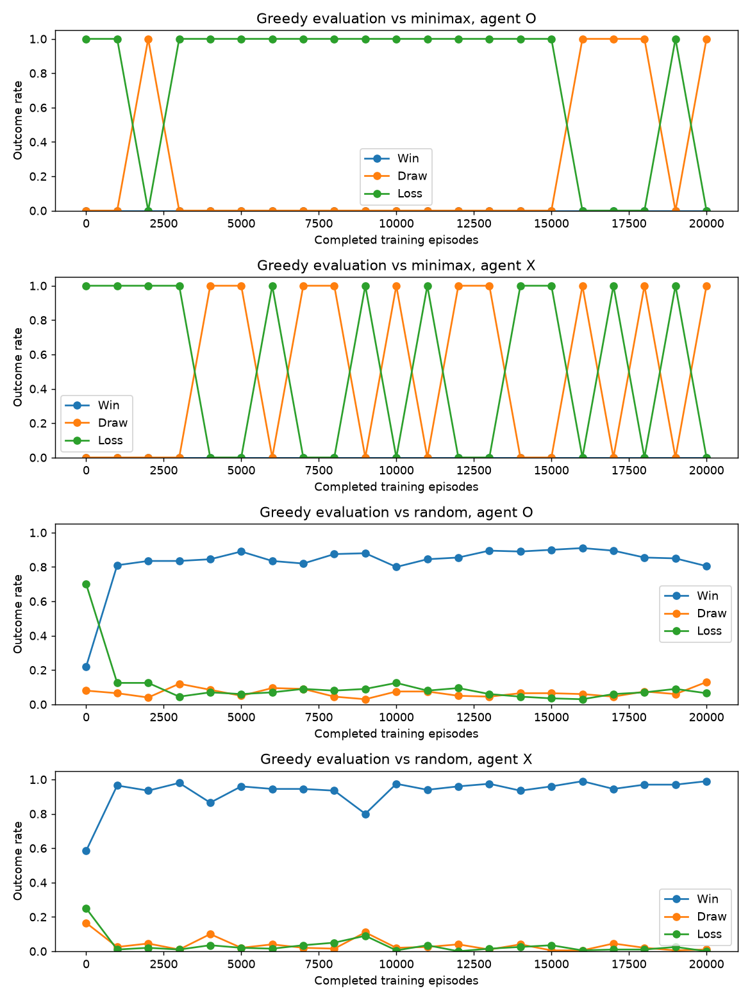

# Reinforcement Learning for Classic Games

[](https://github.com/AMAslam27/Game/actions/workflows/ci.yml)

A Python project exploring reinforcement learning through classic board games,
starting with Tic-Tac-Toe.

The current implementation includes a configurable Deep Q-Network (DQN),
training against random or minimax opponents, evaluation, resumable checkpoints,
and experiment reporting. Self-play and additional games are planned.

## Features

- Tic-Tac-Toe rules and human, random, and minimax players.
- Modular PyTorch networks with dense, dropout, and residual blocks.
- DQN training with experience replay, a target network, and legal-action masking.
- YAML configuration for network architecture and training hyperparameters.
- Configurable optimisers, weight decay, and learning-rate schedulers.
- Evaluation against random and minimax opponents from both player positions.
- Training curves, exploration and learning-rate plots, and timing metrics.
- Saved configurations, checkpoints, and run metadata.

## Getting started

Install dependencies using Poetry:

```sh
poetry install
```

Start training from the repository root:

```sh
poetry run python -m training.tictactoe.train \
  --config training/tictactoe/config.example.yaml
```

Training settings are documented in the
[example configuration](training/tictactoe/config.example.yaml).
Copy it to create a separate experiment configuration.

For a short run:

```sh
poetry run python -m training.tictactoe.train --episodes 1000
```

### Docker

The Compose configuration uses an NVIDIA GPU and requires GPU support in Docker.

```sh
docker compose build
docker compose run --rm tictactoe
```

## Training outputs

Each experiment creates a directory under `training/tictactoe/runs/` containing:

- The resolved configuration and run metadata.
- Episode, decision, update, and evaluation CSV files.
- Model checkpoints and a training log.
- Evaluation game records.
- Plots for returns, outcomes, loss, epsilon, learning rate, and elapsed time.

Resume a run using its checkpoint:

```sh
poetry run python -m training.tictactoe.train \
  --resume training/tictactoe/runs/<run-id>/checkpoints/latest.pt \
  --episodes 30000
```

`--episodes` specifies the total episode target, including episodes already
completed.

## Current results

The first published experiment trained against a random opponent for 20,000
episodes, alternating between X and O.

| Evaluation opponent | Agent seat | Games | Wins | Draws | Losses |
| --- | --- | ---: | ---: | ---: | ---: |
| Random | X | 200 | 198 | 2 | 0 |
| Random | O | 200 | 161 | 26 | 13 |
| Minimax | X | 200 | 0 | 200 | 0 |
| Minimax | O | 200 | 0 | 200 | 0 |

Evaluation used greedy actions with epsilon set to zero.

- Training seed: `42`; evaluation seed: `12345`.
- Network: two dense hidden layers of 64 units with ReLU activation.
- Optimiser: Adam, with learning rate `0.001`.
- Device: CUDA.
- Training time: approximately 183 seconds.
- Evaluation time: approximately 71 seconds.
- Total elapsed time: approximately 294 seconds.

These measurements describe one training seed and the evaluated games.
They do not establish perfect play across every possible board position.
The run recorded uncommitted code changes, so its recorded Git commit alone
does not fully identify the implementation used.



Inspect the [experiment configuration](docs/results/2026-10-05-random/config.yaml),
[evaluation history](docs/results/2026-10-05-random/evaluation.csv),
and [complete plot snapshot](docs/results/2026-10-05-random/).

## Play Tic-Tac-Toe

```sh
poetry run python runner.py --x human --o minimax
```

Available players are `human`, `random`, `minimax`, and `dqn`.

Play against the best registered saved agent:

```sh
poetry run python runner.py --x human --o dqn --o-agent best
```

Use `--o-agent latest` for the most recently completed available run, or choose
any checkpoint explicitly with `--o-checkpoint <path>`. The corresponding
`--x-agent` and `--x-checkpoint` options support agents as X, including matches
between two different saved models. Models are loaded once and play greedy
legal moves without learning. The resolved experiment, checkpoint path, and
hash are displayed and recorded with match results.

Completed training runs register their final checkpoints automatically in
`results/models.sqlite3`. Import older runs before using automatic selection:

```sh
poetry run python -m evaluation.model_registry training/tictactoe/runs/<run-id>
```

Use `--registry <path>` for a different registry in both training and play,
and `--agent-device cpu` to run saved players on CPU. If eligible models use
different evaluation protocols, select one with `--o-protocol <protocol-id>`
(or `--x-protocol`). The [ranking documentation](docs/model-ranking.md)
explains the criteria and how to inspect protocol IDs.

## Project structure

| Directory | Purpose |
| --- | --- |
| `games/` | Game rules and state |
| `players/` | Baseline players |
| `models/` | PyTorch networks and reusable blocks |
| `training/` | Shared training, evaluation, and experiment utilities |
| `training/tictactoe/` | Tic-Tac-Toe adapter, configuration, and training entrypoint |
| `tests/` | Automated tests |
| `docs/results/` | Published experiment snapshots |

## Development

Run the checks used by CI:

```sh
poetry run ruff check .
poetry run ruff format --check .
poetry run mypy .
poetry run pytest
```

## Planned work

- Evaluate training stability across multiple seeds.
- Add self-play training.
- Extend the environment and training framework to additional games.
